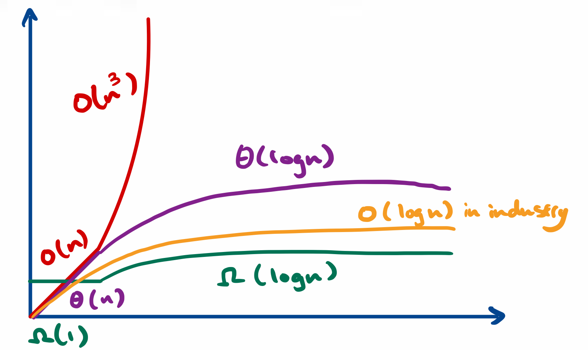

- [1. Introduction](#1-introduction)
- [2. Time Complexity](#2-time-complexity)
  - [2.1. Describing Time Complexity](#21-describing-time-complexity)
    - [2.1.1. Big O (<=)](#211-big-o-)
    - [2.1.2. Big Omega (>=)](#212-big-omega-)
    - [2.1.3. Big Theta (==)](#213-big-theta-)
  - [2.2. Time Complexity Cases](#22-time-complexity-cases)
    - [2.2.1. Best Case](#221-best-case)
    - [2.2.2. Worst Case](#222-worst-case)
    - [2.2.3. Expected Case](#223-expected-case)
  - [2.3. Time Complexity Conclusion](#23-time-complexity-conclusion)
- [3. Space Complexity](#3-space-complexity)
  - [Describing Space Complexity](#describing-space-complexity)
# 1. Introduction
BigO refers to the efficiency of algorithms. This module covers examples and exercises of space and time complexity

# 2. Time Complexity
Time complexity describes the order of the runtime in relation to the size of the input variable. 
There are three ways to describe time complexity and three scenarios which should be considered for every algorithm.

## 2.1. Describing Time Complexity
### 2.1.1. Big O (<=)
Describes upper bound on time. Equivalent to saying *"runtime should be less than or equal to..."*.

### 2.1.2. Big Omega (>=)
Describes lower bound on time. Equivalent to saying *"fastest runtime is..."*.

### 2.1.3. Big Theta (==)
Describes tight bound on time. Equivalent to saying *"fastest and slowest runtimes are bound by...*

Time complexity can change as input scales, and hence in the industry, Big O usually refers to Theta (tight bound). For example:
- Big O can be O(n) for n < 10, and O(n^3) for n >=10, while 
- Big Omega can be Omega(1) for n < 10, and Omega(log n) for n >= 10, while
- Big Theta would Theta(n) for n < 10, and Theta(log n) for n >= 10

## 2.2. Time Complexity Cases 
While time complexity describes runtime against input size, cases describes time complexity against input value.

### 2.2.1. Best Case
- Fastest time complexity
- Not very useful as special case can be implemented for specific input to get O(1) 

### 2.2.2. Worst Case
- Slowest time complexity 
- e.g., repeatedly getting using biggest element in array for quicksort, does not split array in half
 
### 2.2.3. Expected Case
- Expected time complexity which happens most of the time
  
## 2.3. Time Complexity Conclusion
Therefore, in the industry tight bound time complexity should be determined in the worst and expected cases. Constants and non-dominant terms are dropped since its an OoM analysis.

# 3. Space Complexity
Space complexity describes the order of the memory required in relation to the size of the input variable. 

## 3.1. Describing Space Complexity
Described in the same way as time complexity

